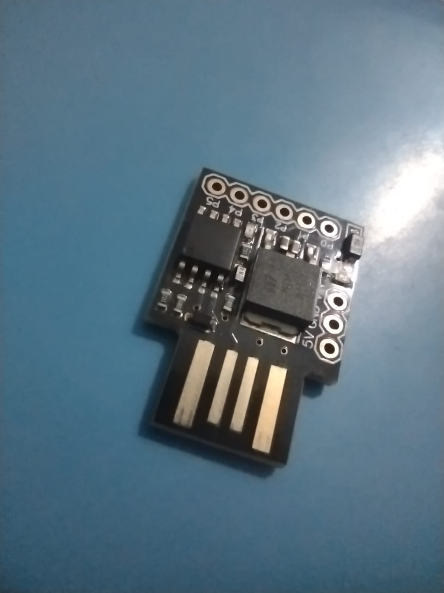

# HID Rick Roller

[](https://github.com/asimos-bot/hid-rick-roller/actions/workflows/main.yml)

The idea is simple: insert the digispark's digistump microntroller in
a usb port of a linux machine with an open focused terminal and let the magic
happen.

When your victim comes back to their computer, what will follow is a series
of grunts and confused expressions from your victim when a new browser window
with a rick rolling video is randomly opened from time to time.

## Requirements

* A friend that uses a terminal
* A digispark's digistump-tiny microcontroller
* docker or arduino-cli with [digistump avr core](https://github.com/ArminJo/DigistumpArduino)

## How to flash the chip

```
make upload
```

This should compile and wait 60 seconds for the chip to be inserted into a port.
After the upload is done, take off the chip before it starts executing and you end
up rick rolling yourself (execution should start after a 3 second wait).

You can also flash the chip using docker. Just execute the following line from inside
the project folder:

```
make docker-upload
```

## What it does

The chip inserts command similar to this at the end of the `~/.bashrc` file:

```
nohup bash -c "sleep $(( $RANDOM % 600 )) && x-www-browser https://archive.org/details/never-gonna-give-you-up-edit-wvm7gv" > /dev/null 2>&1 &
```

As you may know, the contents `~/.bashrc` are executed every time a new terminal
window is opened. When this happen, the command above will open the link given
by `RICK_ROLL_LINK` after a random number of seconds (with the maximum being `ANNOYANCE_LEVEL-1`).
The command will run in the background, detached from the terminal that launched it.

## Disarming

Just remove the added line from `~/.bashrc`.


